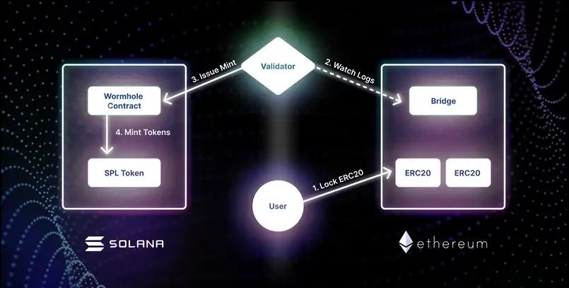
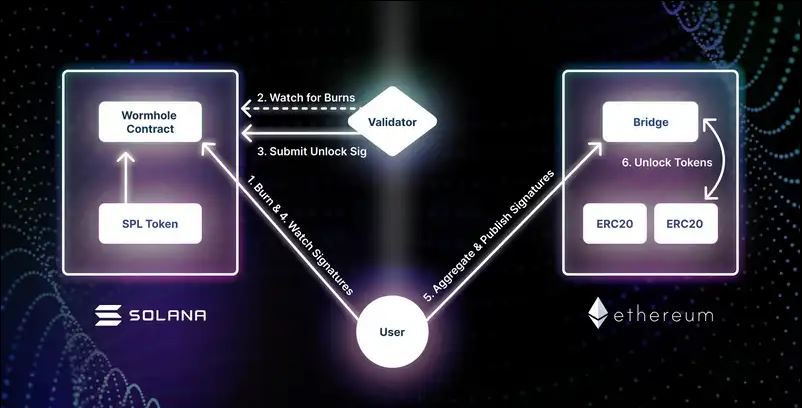
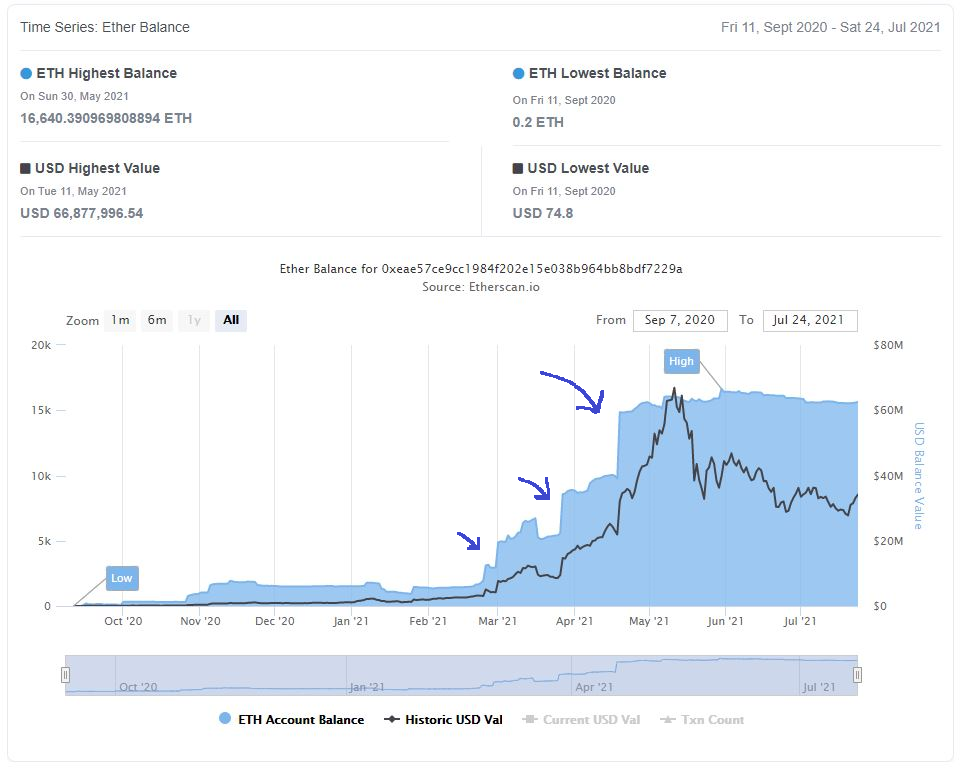
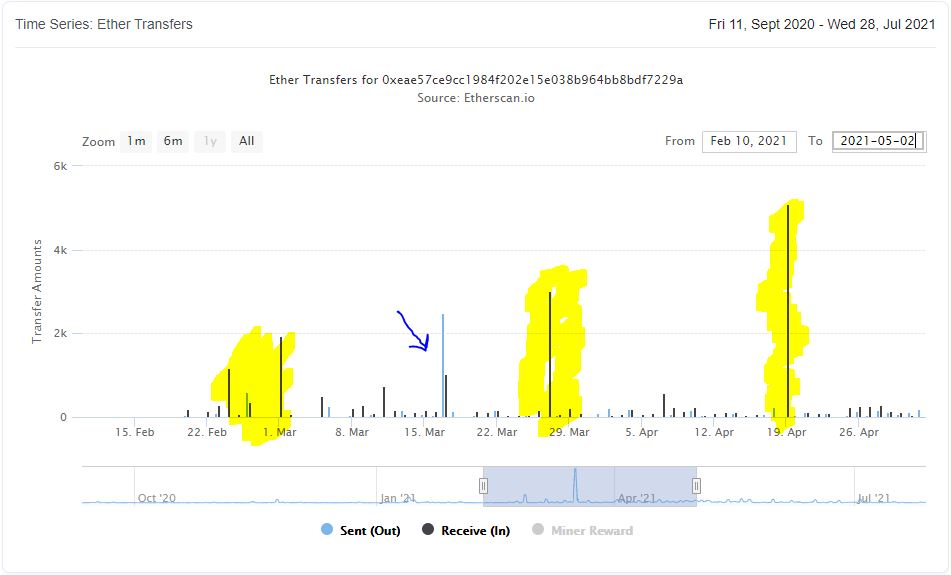

 on Ethereum](images/Capture.JPG)

## Capital flight, DEFI and wormholes

Thanks to [crippling gas fees and congestion on the Ethereum network](https://www.coindesk.com/defi-projects-continue-flocking-to-layer-2-solution-polygon) driven by the continuing [DEFI revolution](https://finance.yahoo.com/news/interest-defi-rising-grayscale-square-105049001.html), we are in the midst of a [cambrian explosion](https://en.wikipedia.org/wiki/Cambrian_explosion) of [Layer 1 and layer 2 scaling solutions](https://www.gemini.com/cryptopedia/blockchain-layer-2-network-layer-1-network#section-what-is-blockchain-scalability). A tremendous amount of capital has started flowing towards projects that either claim to solve the [blockchain trilemma](https://medium.com/certik/the-blockchain-trilemma-decentralized-scalable-and-secure-e9d8c41a87b3), or simply concede decentralization in order to deliver much-needed speed and economy.

Hard on the heels of the top beneficiary of this capital flow, [Polygon](https://polygon.technology/), [Solana](solana.com) - a spanking new blockchain launched in 2017 - has also [managed to raise 314 million dollars](https://www.wsj.com/articles/crypto-startup-solana-raises-314-million-to-develop-faster-blockchain-11623240001) in a bid to be the next home for billions of DEFI dollars. Not to mention the blockbuster funding round that [FTX](https://ftx.com), Solana's biggest cheerleader and strategic investor (via [Serum](https://projectserum.com/), a sprawling DEX ecosystem they built on Solana) [recently bagged](https://www.coindesk.com/ftx-valued-at-18b-in-massive-900m-series-b), some of which is sure to find its way into the Solana ecosystem. 

So how does capital flow into Solana? Remember, the vast majority of non-bitcoin crypto capital resides in the Ethereum blockchain, as ERC20 tokens. Solana, as a new layer 1, is a whole 'nother blockchain, with its own wallets and tokens.

Some of this capital flows through [a wormhole](https://solana.com/wormhole). 

Actually, it looks more like this:

## Anatomy of a wormhole

It's all quite simple. The 'wormhole' is composed of three components:

1. A bridge contract on Ethereum
2. A wormhole contract on Solana
3. A pool of validators running an opensource program that watches both of these contracts for lock (Ethereum) and burn (Solana) events.

- In the first image we see the user (white circle) locking their ERC20 tokens in the bridge contract on Ethereum, along with a target Solana address as metadata. 

- This is observed by the pool of validators (white diamond), who each report it to the wormhole contract on Solana ([along with some cryptographic wizardry](https://medium.com/certus-one/introducing-the-wormhole-bridge-24911b7335f7)). 

- If more than 2/3 of the registered validators report this event, the wormhole contract mints equivalent amounts of SPL tokens for the user address specified in the event metadata.

This is how a user holding ERC20 tokens can 'exchange' them for SPL tokens on Solana, in a quasi-decentralized manner.

The process is (almost) reversed when extracting tokens out of Solana into Ethereum (bottom image): 

- The user burns SPL tokens in the wormhole contract.

- Validators watching for burn events submit signatures attesting that the tokens were indeed burned to the wormhole contract in Solana.

- The user can watch for these signatures, and submit them to the bridge contract on Ethereum to unlock their tokens.

This way the validator program *transacts* solely with Solana, and only *watches* the Ethereum blockchain for lock events.

## Wormhole watching for fun and profit

What can we learn by watching these contracts ourselves? Let's start by looking at the ETH balance on Solana's [bridge contract on Ethereum](https://etherscan.io/address/0xeae57ce9cc1984f202e15e038b964bb8bdf7229a) (as of posting):

As we can see, there were four major gap-ups in February, March and April, which seem to account for most of the $60 million in current locked value. Let's see what this looks like on the Ether transfers graph, scaled appropriately.

Four massive, single-day events, roughly one month apart in February (which had two), March and April, towering over the rest of the traffic. On the 17th of March (the arrow) we have a major withdrawal countering another big day of deposits. What happened on these days? What do these huge movements mean for the Solana ecosystem. How does this impact the Serum ecosystem, which is pretty much the main reason to do anything on Solana right now? Is this capital infusion by promoters to kickstart the ecosystem?

In Part 2, we will investigate all of these questions and ask a few more - especially the most pertinent one: what's a good metric for capital flow over cross-ecosystem bridges?

Stay tuned!

